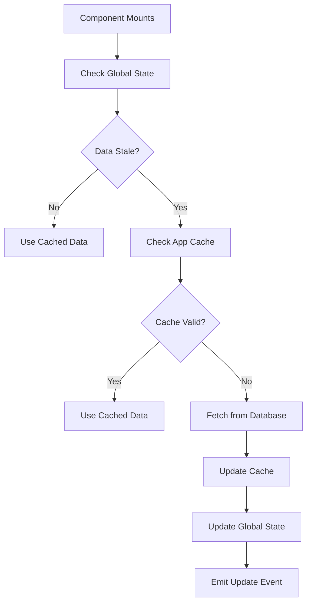
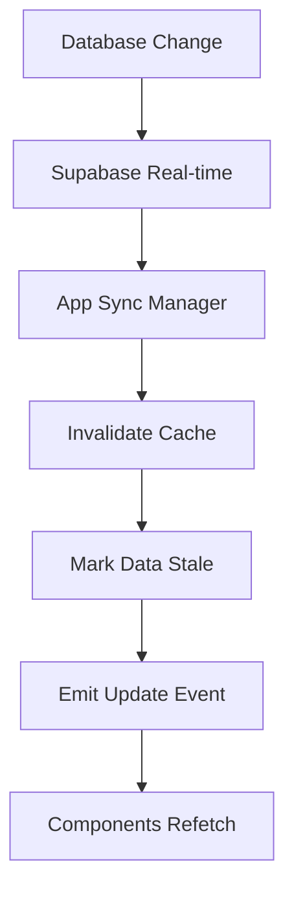
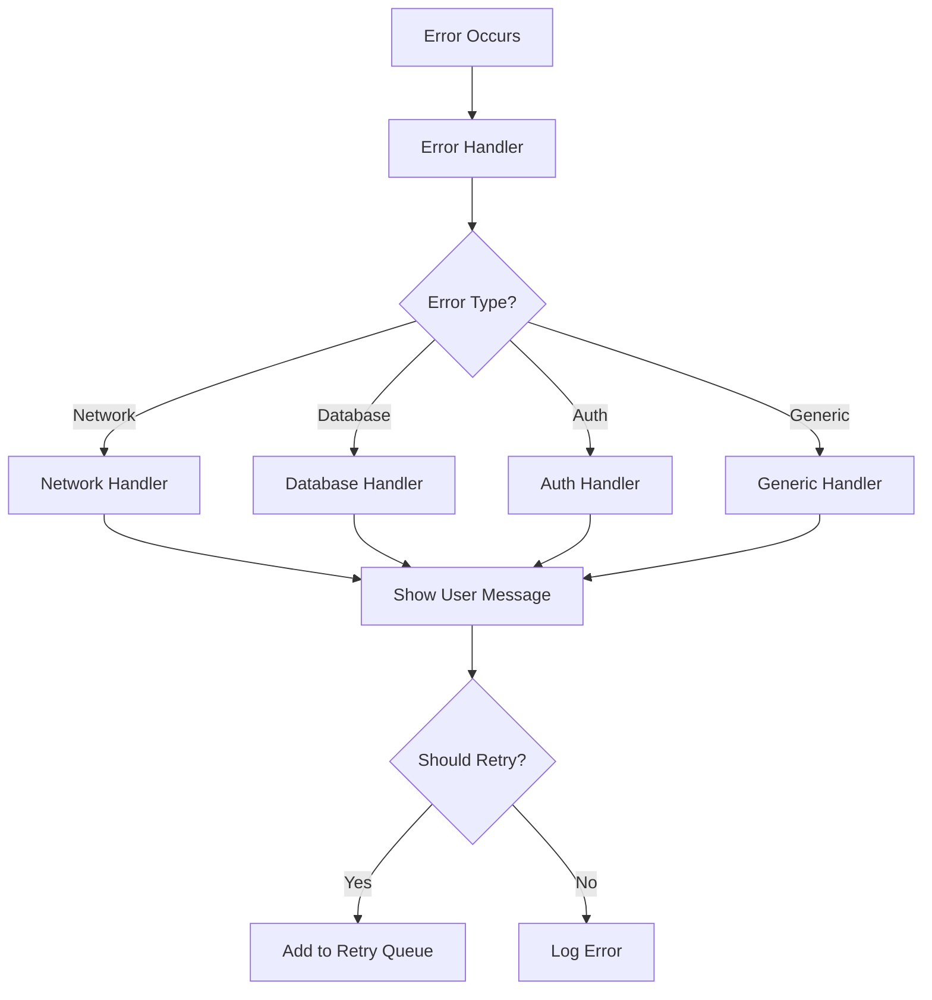

# App Synchronization Architecture

This document describes the comprehensive synchronization system implemented to ensure all components of the Myotopia app work together seamlessly.

## Overview

The app uses a multi-layered synchronization approach:

1. **Global State Management** - Centralized state coordination
2. **Event-Driven Communication** - Cross-component messaging
3. **Smart Caching** - Intelligent data caching with invalidation
4. **Real-time Updates** - Live data synchronization
5. **Error Handling** - Consistent error management
6. **Offline Support** - Network state management

## Key Components

### 1. App Synchronization Manager (`src/utils/appSynchronization.ts`)

**Purpose**: Central hub for all synchronization activities

**Key Features**:
- Event-driven communication between components
- Smart caching with TTL and pattern-based invalidation
- Loading state coordination
- Modal state management
- Network retry queues
- Real-time subscription management

**Usage**:
```typescript
import { useAppSync } from '@/utils/appSynchronization';

const { on, off, emit, setCache, getCache, invalidateCache } = useAppSync();

// Listen for events
on('goals:updated', handleGoalsUpdate);

// Emit events
emit('user:dataChanged', userId);

// Cache management
setCache('user-data', data, 300000); // 5 minutes TTL
const cached = getCache('user-data');
invalidateCache('user-'); // Invalidate all user-related caches
```

### 2. Global State Context (`src/contexts/GlobalStateContext.tsx`)

**Purpose**: Provides app-wide state management and coordination

**State Structure**:
- Data freshness tracking
- Loading states for all major operations
- Error states with detailed error information
- UI state (active modals, etc.)
- Network state and retry queues

**Usage**:
```typescript
import { useGlobalState } from '@/contexts/GlobalStateContext';

const { state, actions } = useGlobalState();

// Set loading state
actions.setLoading('goals', true);

// Mark data as stale
actions.setDataStale('goals', true);

// Handle errors
actions.setError('goals', 'Failed to load goals');

// Modal management
actions.openModal('goal-creation-modal');
```

### 3. Error Handler (`src/utils/errorHandler.ts`)

**Purpose**: Centralized error handling with user-friendly messaging

**Features**:
- Specific handlers for different error types
- Automatic retry mechanisms with exponential backoff
- User-friendly error messages
- Error statistics and monitoring

**Usage**:
```typescript
import { errorHandler, handleAsync } from '@/utils/errorHandler';

// Handle async operations
const { data, error } = await handleAsync(
  () => supabase.from('goals').select('*'),
  'load-goals'
);

// Manual error handling
const appError = errorHandler.handle(error, 'component-name');
```

## Data Flow Architecture

### 1. Component Data Loading



### 2. Real-time Updates



### 3. Error Handling Flow



## Best Practices

### 1. Component Integration

When creating new components:

```typescript
import { useGlobalState } from '@/contexts/GlobalStateContext';
import { useAppSync } from '@/utils/appSynchronization';
import { handleAsync } from '@/utils/errorHandler';

const MyComponent = () => {
  const { state, actions } = useGlobalState();
  const { on, off, emit, getCache, setCache } = useAppSync();

  useEffect(() => {
    // Listen for relevant updates
    const handleUpdate = () => {
      // Refetch data or update UI
    };

    on('relevantData:updated', handleUpdate);
    return () => off('relevantData:updated', handleUpdate);
  }, [on, off]);

  const loadData = async () => {
    actions.setLoading('myData', true);
    
    const { data, error } = await handleAsync(
      () => fetchDataFromAPI(),
      'my-component-load'
    );

    if (data) {
      setCache('my-data', data);
      actions.setDataStale('myData', false);
    }
    
    actions.setLoading('myData', false);
  };

  // Component implementation...
};
```

### 2. Data Mutation

When updating data:

```typescript
const updateGoal = async (goalData) => {
  const { data, error } = await handleAsync(
    () => supabase.from('user_goals').update(goalData),
    'update-goal'
  );

  if (data) {
    // Invalidate related caches
    invalidateCache('user-goals');
    invalidateCache('progress-data');
    
    // Emit update events
    emit('goals:updated');
    emit('progress:updated');
    
    // Update global state
    actions.setDataStale('goals', true);
    actions.setDataStale('progress', true);
  }
};
```

### 3. Modal Management

```typescript
const openModal = () => {
  actions.openModal('my-modal-id');
  setShowModal(true);
};

const closeModal = () => {
  actions.closeModal('my-modal-id');
  setShowModal(false);
};
```

## Performance Considerations

### 1. Cache Strategy

- **Short TTL** (30 seconds) for frequently changing data
- **Long TTL** (5 minutes) for relatively stable data
- **Pattern-based invalidation** for related data cleanup
- **Memory limits** to prevent unbounded growth

### 2. Event Optimization

- **Debounced events** to prevent excessive updates
- **Event namespacing** for targeted listening
- **Automatic cleanup** to prevent memory leaks

### 3. Loading States

- **Granular loading states** for different data types
- **Skeleton loading** for better perceived performance
- **Progressive loading** for complex data sets

## Testing Synchronization

### 1. Unit Tests

Test individual synchronization components:

```typescript
describe('App Synchronization', () => {
  it('should invalidate cache patterns correctly', () => {
    appSync.setCache('user-123-goals', data);
    appSync.setCache('user-123-progress', data);
    appSync.invalidateCache('user-123');
    expect(appSync.getCache('user-123-goals')).toBeNull();
  });
});
```

### 2. Integration Tests

Test cross-component communication:

```typescript
describe('Component Synchronization', () => {
  it('should update all components when goal is created', async () => {
    // Create goal in one component
    await createGoal(goalData);
    
    // Verify other components receive updates
    expect(mockProgressComponent.refetch).toHaveBeenCalled();
    expect(mockDashboard.updateGoals).toHaveBeenCalled();
  });
});
```

## Troubleshooting

### Common Issues

1. **Stale Data**: Check if cache invalidation is working properly
2. **Missing Updates**: Verify event listeners are set up correctly
3. **Performance Issues**: Check for excessive event emissions or cache misses
4. **Memory Leaks**: Ensure event listeners are cleaned up on unmount

### Debugging Tools

Use the browser console to monitor synchronization:

```typescript
// Check active event listeners
console.log(appSync.eventListeners);

// Check cache contents
console.log(appSync.cache);

// Monitor events
appSync.on('*', (event, ...args) => {
  console.log('Event:', event, args);
});
```

## Future Improvements

1. **Conflict Resolution**: Handle concurrent data modifications
2. **Optimistic Updates**: Immediate UI updates with rollback on failure
3. **Background Sync**: Sync data when app becomes active
4. **Analytics Integration**: Track synchronization patterns for optimization
5. **A/B Testing**: Test different synchronization strategies